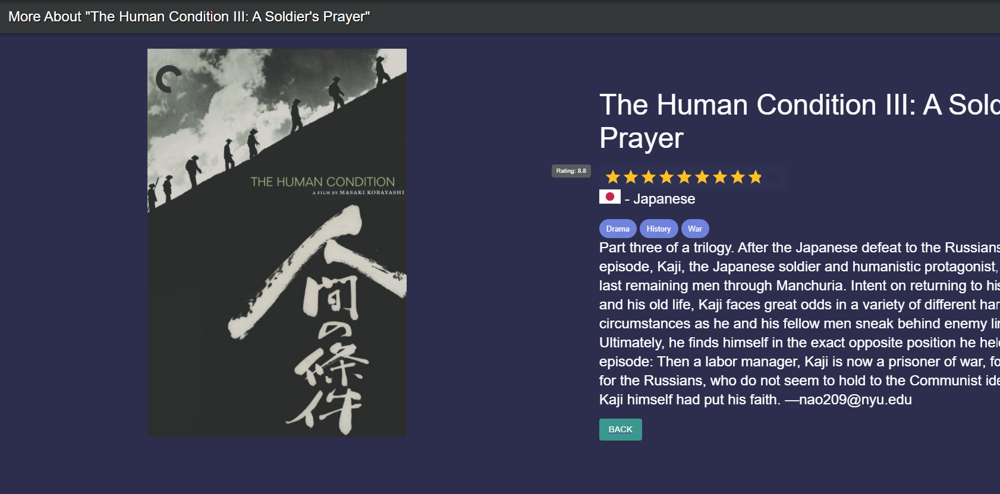
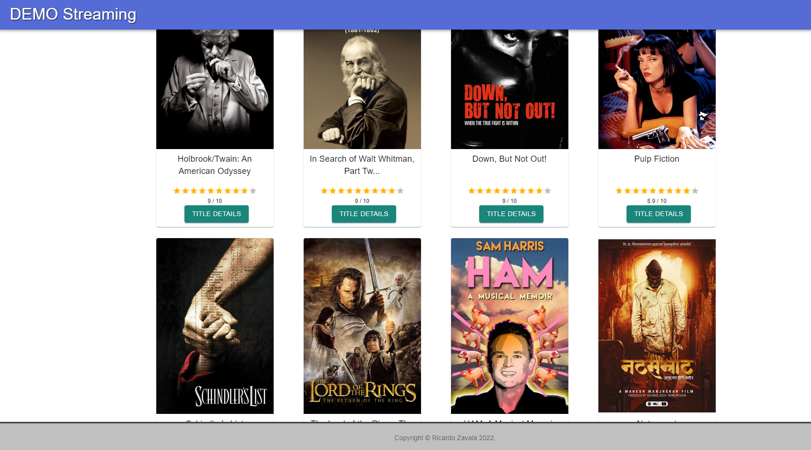

# ALL INSTALLATIONS ARE DONE WITH YARN

Hello and THANK YOU for taking time to consider me for the position. This app is to demonstrate a quick overview of implementing a simple full stack React app with a GraphQL server. This movie app is bootstrapped with MUI (version 4) and an Apollo Client. There are two query calls, <b>getMovies</b> (list of movies) and <b>getTitle</b> (more in-depth details for an individual movie's page). Note that I did actually elect to use real JSON data as opposed to mock data as it left me to comb through a larger HTTP response in order to allow me to demonstrate skills that I wouldn't be able to do with simpler data, as I like a good challenge!

I didn't do TOO much however, as I would keep making improvements all day. I have my calls fixed to 50 results, but I can also add a search query as well as pagination and changing the limit of results with an input on the home page, but for the sake of time I believe this is a very sufficient attempt (as you also said you didn't want me to go too deep into this first challenge)

Also, there are no warnings, and all my styled components are siloed in one place, as are all my utils and naming conventions




### src config (already done so you shouldn't have to)

- [jsconfig.json](https://code.visualstudio.com/docs/languages/jsconfig)

# css - [Material-UI](https://material-ui.com/getting-started/installation/)

### Step 1 : Install within client folder

```sh
cd client

yarn install
```

### Step 2 : Navigate (cd..) back out of client folder, and then navigate to server folder

```sh
cd ..
cd server/


yarn install
```

### Step 3 : Run the server in one terminal window...

```sh
(in '/server' folder)

yarn start
```

### Step 4 : Keep the server running, open a different terminal window and navigate back to client folder and run the client

```sh

yarn start
```

- NOTES

- I used a real API, like I stated before, so I could take advantage of a lot of what MUI offers users and developers alike.
- I knew I was spending too much time with the UI so I did not finish the Navbar dummy buttons, like the login and signup, because it isn't why this challenge is so important
- I also did a considerable amount of subtle tasks, such as tranforming some of the data coming in from the back end, such as changing the names of some props in regards to the images, as well as making the language codes coming from the back end into country names and even SVGs to display flags of the regions where the films came from on the detail pages through the use of HOCs and object literals
